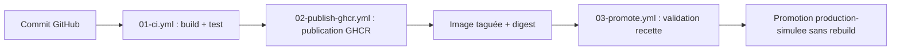

# 02 - Schéma de la chaîne CICD

## Schéma logique

## Explication

Décrire en quelques lignes le rôle de chaque étape.

## Orchestration légère

Le fichier compose.yml décrit un service web et un second service de test. Il sert à documenter et simuler une coordination de conteneurs, sans prétendre remplacer une orchestration de production.

## Limite importante

Docker Compose est utile pour une mise en situation, un test local ou une démonstration de coordination. En production réelle, il faudrait traiter d'autres sujets : haute disponibilité, répartition de charge, supervision, politique de déploiement, rollback, sécurité, sauvegarde et restauration.
