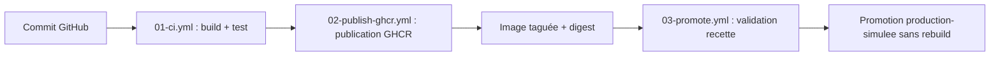

# 02 - Schéma de la chaîne CICD

## Schéma logique

```mermaid
flowchart LR
    A[Commit GitHub] --> B[01-ci.yml : build + test]
    B --> C[02-publish-ghcr.yml : publication GHCR]
    C --> D[Image taguée + digest]
    D --> E[03-promote.yml : validation recette]
    E --> F[Promotion production-simulee sans rebuild]
```

## Explication

**A → B : Commit GitHub déclenche le CI**
Chaque push sur le dépôt déclenche automatiquement le workflow 01-ci.yml. Il vérifie
que les fichiers attendus sont présents (Dockerfile, compose.yml, index.html,
version.json), valide la syntaxe du compose.yml, construit l'image Docker et démarre
un conteneur pour tester HTTP sur / et /version.json. Si un test échoue, le pipeline
s'arrête et rien n'est publié.

**B → C : Publication dans GHCR**
Si le CI réussit, le workflow 02-publish-ghcr.yml publie l'image dans GitHub Container
Registry. L'authentification se fait via le GITHUB_TOKEN sans aucun secret à gérer
manuellement.

**C → D : Image taguée et identifiée**
L'image est publiée avec deux tags : un tag sha- lié au commit Git (ex: sha-cee92d4)
et le tag latest. Le digest sha256 est affiché dans le résumé du job. Ces éléments
permettent d'identifier précisément l'artefact et de le retrouver pour un rollback.

**D → E : Validation en recette simulée**
Le workflow 03-promote.yml est déclenché manuellement. L'opérateur choisit le tag à
promouvoir. Le job validate-recette tire l'image depuis GHCR sans rebuild, démarre un
conteneur et reteste HTTP pour confirmer que l'image fonctionne correctement.

**E → F : Promotion en production simulée sans rebuild**
Si la validation recette réussit, le job promote-production-simulee retague l'image
vers production-simulee et la repousse dans GHCR. Aucun docker build n'est exécuté :
le digest reste identique entre recette et production, ce qui garantit que l'artefact
déployé est exactement celui qui a été testé.

## Orchestration légère

Le fichier compose.yml décrit deux services sur un réseau bridge cicd_net :
- web : le serveur Nginx qui sert le site statique.
- tester : un conteneur curlimages/curl qui teste automatiquement les URLs /
  et /version.json au démarrage, puis s'arrête.

Il sert à documenter et simuler une coordination de conteneurs, sans prétendre
remplacer une orchestration de production.

## Limite importante

Docker Compose est utile pour une mise en situation, un test local ou une démonstration
de coordination. En production réelle, il faudrait traiter d'autres sujets : haute
disponibilité, répartition de charge (le scaling avec --scale web=2 ne distribue pas
le trafic automatiquement sur un port externe), supervision, politique de déploiement,
rollback, sécurité, sauvegarde et restauration.